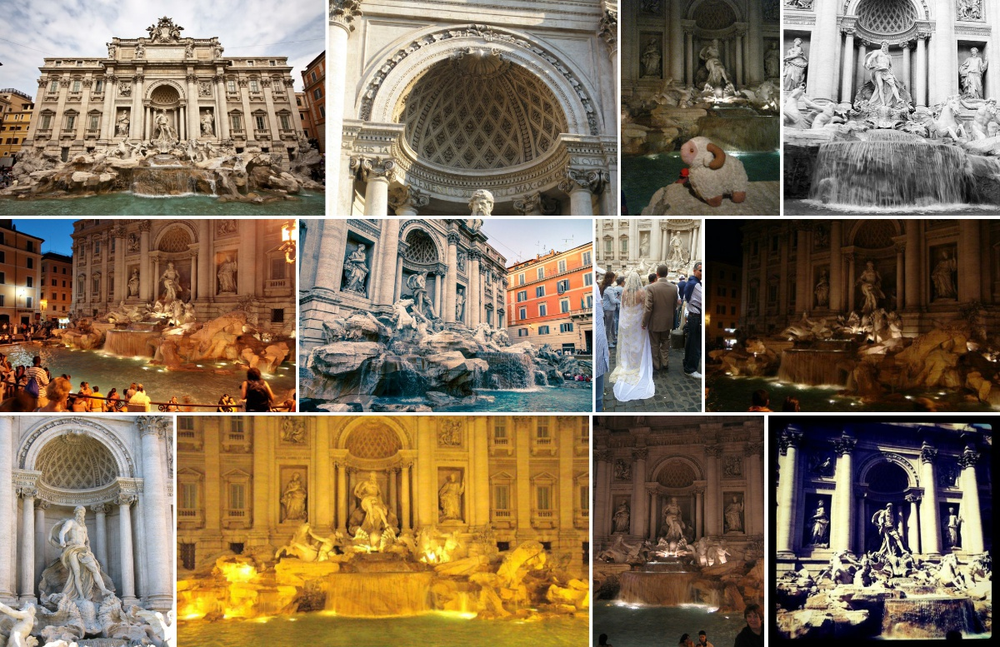
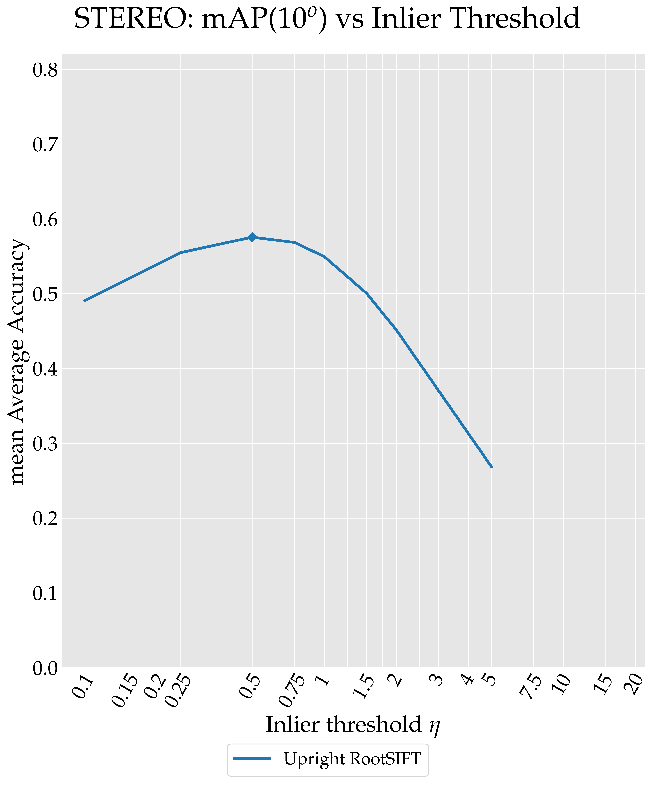
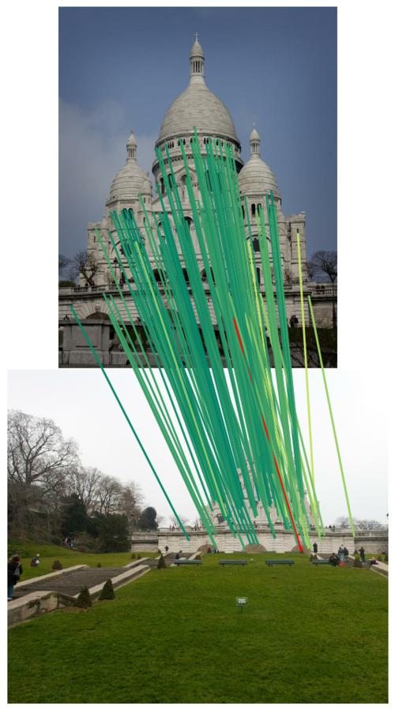
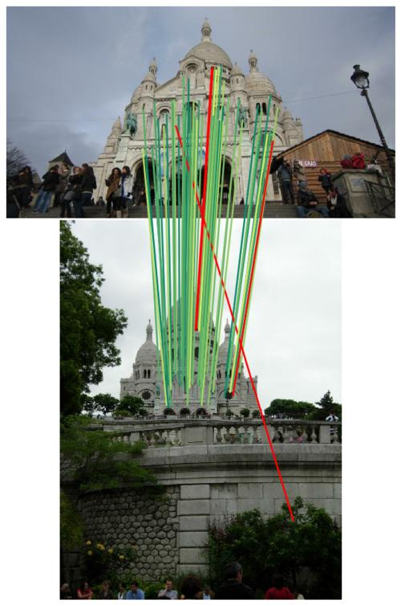
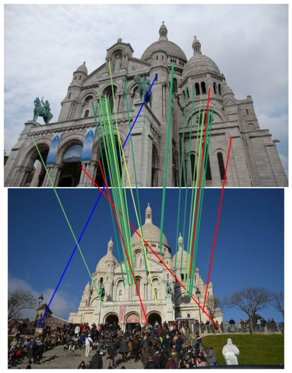
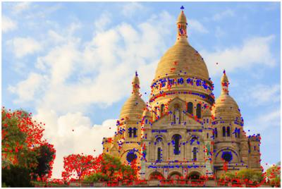
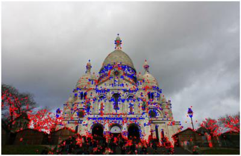
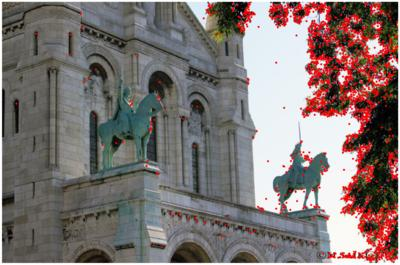

# Image Matching Benchmark

**Warning: If you use the multi-view part of the benchmark, please use COLMAP 3.5.** Newer versions change the behaviour of COLMAP when it cannot find a good initial pair to start the reconstruction, which now triggers a failure instead of a warning. This cascades into the benchmark.

This is the code release for the Image Matching benchmark, which is the basis of a [challenge](https://image-matching-challenge.github.io/) on wide-baseline image matching co-located with the CVPR 2020 workshop on [Image Matching: Local Features and Beyond](https://image-matching-workshop.github.io/). Its goal is to allow researchers to evaluate methods for local feature extraction and matching, using downstream metrics such as the accuracy of the final poses, on a standardized benchmark, against and alongside state-of-the-art methods for every stage of the traditional image matching pipeline.

Running the benchmark requires writing a configuration file and, typically, providing pre-computed features (and matches). We provide a validation set with three sequences. Challenge submissions will be sent to the organizers and processed on a private test set, for which we provide images, but not the ground truth. This release aims to help with the following:
* Centralize feature extraction and matching methods in a modular framework.
* Find the right hyperparameters on a validation set.
* Provide introspection tools.

For more information, please refer to the following:

* [Challenge and leaderboards](https://image-matching-challenge.github.io/)
   * [Terms and conditions](https://www.cs.ubc.ca/research/image-matching-challenge/submit/index.html#tac)
* [Data download link](https://www.cs.ubc.ca/~kmyi/imw2020/data.html)
  * Parsing the training data: see example on `example/training_data/parse_data.ipynb`.
* [Baselines repository](https://github.com/ubc-vision/image-matching-benchmark-baselines)
* [Instructions to set up a scalable Slurm cluster on GCP](https://github.com/etrulls/slurm-gcp)

## Citation

If you use this benchmark, please cite the following paper:

```
@article{Jin2020,
    author={Yuhe Jin and Dmytro Mishkin and Anastasiia Mishchuk and Jiri Matas and Pascal Fua and Kwang Moo Yi and Eduard Trulls},
    title={{Image Matching across Wide Baselines: From Paper to Practice}},
    journal={International Journal of Computer Vision},
    year={2020}
}
```

## Motivation

Local features are the foundation of a large number of applications in computer vision, and (arguably) remain the state of the art in 3D reconstruction and re-localization. New methods have historically been evaluated on small, de-centralized datasets with intermediate metrics, specially for local features, such as keypoint repeatability or descriptor matching score. This may misrepresent actual performance and hinder the development of new techniques. There is a clear need for new, large-scale benchmarks with comprehensive evaluation protocols and baselines. Towards this end, we held in 2019 the first edition of this challenge. We have greatly improved on it for its second edition, and open-sourced the codebase. It contains wrappers over dozens of state-of-the-art methods for extracting and matching local features, in a modular framework.

We rely on rich, phototourism data. Our (pseudo-) ground truth comes from large-scale Structure-from-motion (SfM) reconstructions obtained with [Colmap](https://colmap.github.io/) with exhaustive matching, which produces accurate 6DOF poses. This solution allows us to consider images with large viewpoint and photometric differences.

<div style="text-align: center;"></div>

The core assumption behind this benchmark is that we can then subsample these subsets to make the problem much harder. The test set contains 10 scenes with 100 images each. We extract features for each one, match them exhaustively (within a scene), and feed the results to multiple tasks, such as wide-baseline stereo or multi-view reconstruction with small image subsets (5, 10, 25 images). More tasks are currently being developed.

## Installation

Ground truth data and benchmark should be placed on the same folder, e.g.:

```

$ ls ~
data
image-matching-benchmark
[...]

$ ls ~/data
phototourism

$ ls ~/data/phototourism/
sacre_coeur      reichstag      st_peters_square
```

At runtime, two more folders will be created at this level. All results (features, matches, stereo, etc) will be placed inside `benchmark-results`. Automated visualizations (examples below) will be placed inside `benchmark-visualizations`.

After cloning the repository, download third-party modules with the following:

```
git submodule update --init
```

The benchmark requires [OpenCV](https://github.com/opencv/opencv): you can do this easily from conda. Please note that some feature methods, such as SIFT, are **not free** and have to be installed from the [OpenCV contrib repository](https://github.com/opencv/opencv_contrib): this is only required if you want to extract these features.

This codebase requires a lot of compute and is heavily parallelized, relying on the [Slurm job scheduler](https://www.schedmd.com/). We provide instructions to set up a scalable, on-demand cluster on the Google Cloud Platform (GCP) [here](https://github.com/etrulls/slurm-gcp) as an example: remember that GCP offers [$300 in free credit](https://cloud.google.com/free) to new users. Alternatively, it is possible to run it on a single thread with the `--run_mode=interactive` flag. Please keep in mind that this may take some time: on the validation set, it requires running stereo for ~15k image pairs and ~500 (small) 3D reconstructions with Colmap.

The codebase is written in Python 3. The easiest way to handle dependencies is via conda, which can be installed as follows (on Linux):

```bash
wget https://repo.anaconda.com/miniconda/Miniconda3-latest-Linux-x86_64.sh
bash Miniconda3-latest-Linux-x86_64.sh
```

You can then create an environment with all dependencies. We provide examples for Ubuntu and CentOS 7 on the `system` folder. They may need some tweaking for your specific set-up.

```bash
conda env create -f system/<your_choice>.yml
```

Alternatively, if you are experiencing library conflicts, you can use this series of install commands, used to create conda_end_dm.yml:

```bash
conda create -n sfm python=3.7
conda activate sfm
conda install -c conda-forge opencv==4.5.2 scipy matplotlib
conda install h5py joblib tqdm 
pip install schema shortuuid jsmin pydegensac
``` 

Colmap should be installed separately, and its binaries be visible in the system path. You can follow [this documentation](https://colmap.github.io/install.html).

For stereo, we provide wrappers around OpenCV RANSAC, which is far from the state of the art ([examples](https://github.com/opencv/opencv/pull/16498#issue-370691424)). We also provide wrappers around GC-RANSAC, DEGENSAC and MAGSAC. Note that you may not need any of these if you want to provide a final set of matches directly, bypassing standard robust estimators. You can install them into your conda environment as follows.

For DEGENSAC:
```
pip install pydegensac
```

For MAGSAC:
```
pip install git+https://github.com/ducha-aiki/pymagsac
```

For GC-RANSAC:
```
pip install git+https://github.com/danini/graph-cut-ransac@benchmark-version
```

Alternatively, follow the instructions to compile them. GCP deployments based on CentOS may require some changes to the CMake configuration files: we will clarify this [here](https://github.com/etrulls/slurm-gcp).

## Configuration

Metadata and hyperparameters are specified via configuration files written in the JSON format. You can find some examples under `example/configs`. They look like this:

```
{
  "metadata": {
      "publish_anonymously_until_challenge": false,
      "authors": "Challenge organizers",
      "contact_email": "image-matching@googlegroups.com",
      "method_name": "SIFT (OpenCV)",
      "method_description": "Just a test!",
      "link_to_website": "https://www.opencv.org",
      "link_to_pdf": "",  /* empty */
  },
  "config_common": {
      "json_label": "name-for-the-results-file", /* without extension */
      "keypoint": "siftdef", /* SIFT detector, default */
      "descriptor": "rootsift", /* SIFT descriptors */
      "num_keypoints": 2048,
  },
  "config_phototourism_stereo": {
     (...)
```

Metadata is only necessary for challenge submissions. The fields in `config_common` are common across all tasks and datasets. The number of features (maximum number of features for any one image, not an average) and descriptor dimensionality will determine the category the submission will fall on for the challenge: please refer to the website for details.

You can then specify a different configuration for each task. For example:

```json
  (...)
  "config_phototourism_stereo": {
      "use_custom_matches": false,
      "matcher": {
          "method": "nn",
          "distance": "L2",
          "flann": true,
          "num_nn": 1,
          "filtering": {
              "type": "snn_ratio_pairwise",
              "threshold": 0.9
          },
          "symmetric": {
              "enabled": true,
              "reduce": "both"
          }
      },
      "outlier_filter": {
          "method": "none"
      },
      "geom": {
          "method": "cmp-degensac-f",
          "threshold": 0.5,
          "confidence": 0.999999,
          "max_iter": 100000,
          "error_type": "sampson",
          "degeneracy_check": true
      }
  },
  "config_phototourism_multiview": {
      "use_custom_matches": false,
      "matcher": {
          "method": "nn",
          "distance": "L2",
          "flann": true,
          "num_nn": 1,
          "filtering": {
              "type": "snn_ratio_pairwise",
              "threshold": 0.9
          },
          "symmetric": {
              "enabled": true,
              "reduce": "both"
          }
      },
      "outlier_filter": {
          "method": "none"
      },
      "colmap": {}
  }
  (...)
```

The stereo task supports options for the feature matcher in `matcher`, an optional outlier filter in `outlier_filter`, and the robust estimator in `geom`. The multiview tasks supports `matcher` and `outlier_filter`; the `colmap` field should be empty for now, as we do not pass any options. For details about these options, please refer to the source code. For reasonable defaults, please refer to the examples on `json/method` or our paper (WIP). If you do not want to process a specific task, you can delete the field or leave it empty. Strings are not case-sensitive.

For the `matcher`:
* `method`: all current options are implemented in `methods/feature_matching/nn.py`
* `distance`: `l2` or `hamming`
* `flann`: enable it for faster matching with OpenCV (must be off for binary features)
* `num_nn`: number of nearest neighbours used to build the match list (typically: 1)
* `filtering`: includes options such as the ratio test
  * `type`: we recommend `snn_ratio_pairwise` for the standard ratio test; `none` otherwise
  * `threshold`: threshold for the ratio test
  * `symmetric`: enables matching image A to B and B to A
    * `reduce`: `both` takes the intersection of these two lists (cycle-consistent matches); `either` takes their union (removing duplicates)

The `outlier_filter` field can be used to specify an optional outlier filter, which runs before RANSAC or Colmap. We have implemented our prior work on [outlier filtering with deep networks](https://arxiv.org/abs/1711.05971), which has been retrained on more data. More options will be added in the future. Please note that the goal of this option is to make it easier to compute baselines: we expect comprehensive submissions to provide matches explicitly.

The `geom` field is used to specify the robust estimator used in stereo:
* `method`: please refer to `methods/geom_models` for options.
  * `threshold`: inlier threshold: must be set separately for each feature type
  * `confidence`: confidence level to stop iterating: we cap this to 0.999999, which we recommend using
  * `max_iter`: maximum number of RANSAC iterations, on supported methods

The `colmap` field is currently unused. For a comprehensive list of options, please refer to the source code. Note that different tracks have different settings for common tasks, because the optimal values might differ. For instance, the optimal ratio test for the stereo and multi-view tasks is usually different.

Finally, this configuration file should be written as a list, which you can use to you can specify different configurations in a single file:

```
[
   { <method_1> },
   { <method_2> },
   { <method_3> }
]
```

You can see more examples in the [evaluation server](https://www.cs.ubc.ca/research/image-matching-challenge/leaderboard/), which stores the raw configuration files.

## Importing your own features/matches

Local features from OpenCV (e.g. SIFT or ORB) can be computed directly from the benchmark: please refer to `methods/local_feature` for documentation about their options. Other methods should extract features separately and import them via HDF5 files. We provide a simple example, for illustration, [here](https://www.cs.ubc.ca/research/image-matching-challenge/submit/), and wrappers over several methods on a [separate repository](https://github.com/ubc-vision/image-matching-benchmark-baselines): feel free to add your own. You can then import them into the benchmark with the `import_features.py` script:

```bash
python import_features.py --path_features=<path_to_folder> --kp_name=<kp_name> --desc_name=<desc_name> --num_keypoints=2048
```

We also give the option of providing custom matches, in order to support learned matchers without directly embedding them into the pipeline.
Please note that we still require the descriptors file. Please make sure number of keypoints is below 2048 or 8000 (the two categories we consider) **for every image**: when working with custom matches, we do not subsample the keypoint list, and the submission will be rejected.

To use this option, set the `use_custom_matches` field to `true`: `matcher` and `outlier_filter` will not be allowed, and an additional `custom_matches_name` field needs to be specified, which can be used to disambiguate between submissions:

```json
        "config_phototourism_stereo": {
            "use_custom_matches": true,
            "custom_matches_name": "custom_match",
            "geom": {
                "method": "cv2-8pt"
            },
        },
        "config_phototourism_multiview": {
            "use_custom_matches": true,
            "custom_matches_name": "custom_match",
            "colmap": {},
        },
```

If you are submitting a single match file, name it `matches.h5`: it will be used for both stereo and multi-view.
We recommend tuning stereo and multi-view separately: if so, name the stereo match file as `matches_stereo_0` and the multiview file as `matches_multiview`.
For stereo, we will compute poses with the specified matches, given to the 8-point algorithm: please note that you may use other robust matchers (RANSAC variants) along with custom matches for validation, but this is not allowed for challenge submissions: if you want to run custom matchers and then RANSAC, do it yourself.
For multiview, we give these matches to Colmap.

In order to study the randomness in RANSAC/Colmap, we compute typically three runs for every submission. In order to mimic this with custom matches, you may optinally submit three match files for stereo, named as `matches_stereo_0`, `matches_stereo_1`, and `matches_stereo_2`; the variability in the multi-view task comes mostly from Bundle Adjustment, so consider only one file.

You can import custom match files with the following command:

```bash
python import_features.py --path_features=<path_to_folder> --kp_name=<kp_name> --desc_name=<desc_name> --match_name=<match_name>
```

(Custom matches are a recent addition: please reach out to us via email/github issues if you encounter problems using it.)

## Using validation script to validate your submission
Plase always run `submission_validator.py` on your submission zip file to make sure your submission is in proper format before uploading to our [challenge website](https://www.cs.ubc.ca/research/image-matching-challenge/submit/).

## Terms and conditions

Challenge submissions have additional restrictions in place, such as for instance in the maximum number of iterations in the RANSAC loop, or banning robust estimators which assume known intrinsics and estimate the Essential matrix instead of the Fundamental matrix (which are implemented in the benchmark for the sake of completeness). Please refer to the [submission page](https://www.cs.ubc.ca/research/image-matching-challenge/submit/) on the website for further details.

## Usage

The entry point is `run.py`:

```bash
python run.py --json_method=<config_file>.json
```

These are the most common runtime options:
* `--run_mode`: `batch` (default) to use slurm, `interactive` to run each job in sequence on a single thread
* `--eval_stereo` and `--eval_multiview`: allows you to bypass a task without deleting it from the configuration JSON.
* `--run_viz` generates visualizations for a finished run and places them on `../benchmark-visualizations`. For a finished experiment, you can add the flag `--skip_packing=False` to bypass re-generating the results JSON, which is slow.
* You can optionally average the results over multiple runs with `--num_runs_<subset>_<task>`. Challenge submissions will be averaged over three runs. We recommend a single run for validation.

When running in parallel with Slurm (`--run_mode=batch`), we automatically determine the dependencies for each job and schedule them accordingly. For instance, if you evaluate SIFT features under different matchers, the features will only be extracted once. If you test those matches with a RANSAC variant with different sets of hyperparameters, both features and matches will also only be computed once. There is **one important caveat:** this check happens at runtime, so jobs which may collide should be placed in the same JSON file to prevent race conditions. We explored different alternatives, such as file-based locks, but they are too costly or hard to maintain alongside Slurm.

You can see `config.py` or run `python run.py --help` for more options.

Tasks are broken down into discrete jobs which are placed in the `jobs` folder and sent to the scheduler. Their output is logged in the `logs` folder: you can inspect these to check on their progress or for debugging.

## Parsing the results

All intermediate data is placed inside `../benchmark-results` (note that this folder may quickly become very large). Results are written in JSON files into `packed-val` (for validation).

The main metric is the quality of the estimated poses. We measure them in relative terms, as stereo poses can be recovered up to a scale factor. To measure the accuracy for a given pair of images, we compute the angular error between the estimated and ground truth rotation vectors and the estimated and ground truth translation vectors, and take the largest of the two. We threshold this error to reach a binary decision, e.g. is this estimate accurate at 5 or 10 degrees, and accumulate it over multiple image pairs to compute the "average accuracy". We do this for multiple error thresholds, from 1 to 10 degrees with a 1-degree resolution. Finally, we compute the area under this curve: this gives us a single scalar value, that we call "mean Average Accuracy" or mAA, analogously to the mean Average Precision or mAP commonly used in object detection.

We provide simple co-visibility estimates for each pair of images, which can be used to evaluate how methods perform across easier or more challenging pairs. By default, we report results for a co-visibility threshold of 0.1 or above (indicated by the `_th_0.1` suffix in the results file).

In the multi-view track, we use Colmap to obtain 3D reconstructions from small sets of images. We then take every pair of two images and compute the error using this pairwise metric. This has several advantages. First, it allows us to share a single metric across multiple tasks. Second, it does not require accurate metric estimates in the ground truth, which require additional steps to estimate the size of the scene (as SfM reconstructions are not up to scale). Third, it is less sensitive to the range of the scene than metric errors. This track does not consider co-visibility constraints (other than to create the image subsets in the first place), as all images are bundle-adjusted at once.

We also compute traditional metrics such as repeatability or matching scores, at different pixel thresholds. Please note that these are computed using the densified depth estimated by Colmap as ground truth, which is unreliable at very small thresholds. Some fields in the results file do not contain a suffix (e.g. `repeatability` in addition to `repeatability_th_0.1`): they rely on an older co-visibility metric and are only preserved for consistency.

## Examples

We suggest a series of steps to tune a submission in an upcoming paper, and provide examples in the `example` folder, for Root-SIFT. The first step is to tune the matcher. We recommend to simply pick a reasonable (maybe sub-optimal) value for the ratio test threshold and use symmetric matching with `'reduce': 'both'`: look at `methods/feature_matching/nn.py` for further options. The next step is to tune the inlier threshold for the robust matcher:

```
python run.py --subset=val --json_method=json/method/example-validation-inlier-th.json --run_viz=False
```

This example will create 8 runs, with an inlier threshold between 0.1 and 5 pixels. The results will be written into `packed-val` and can be parsed with `notebooks/example.ipynb`. We can see that the optimal value is 0.5 pixels (by contrast, the default threshold for OpenCV is 3 pixels):

<div style="text-align: center;"></div>

Now we can fine-tune the ratio test threshold, if appropriate:

```
python run.py --subset=val --json_method=json/method/example-validation-ratio-test.json --run_viz=False
```

This example will create 9 runs, with a ratio test threshold between 0.6 and 1 (i.e. no ratio test) each for stereo and multi-view. Note that entries which have already been computed, such as the default ratio test value used in the previous example, will not be recomputed. With the same notebook, we see that the optimal threshold is already at 0.9:

<div style="text-align: center;"></div>

We can now use the optimal settings to write a configuration file for a challenge submission: see `json/method/example-test.json`. We also provide an example of the results file on the test set in `example/results/test/rootsift-upright-2k-both-degensac.json`.

The benchmark automatically generates some stereo and multiview visualizations (which can be disabled with `--run_viz=False`). We show stereo matches and color-code them by reprojection error, computed using the ground truth depth maps, in green to yellow if they are correct (with green encoding 0 reprojection error and yellow a maximum reprojection error of 5 pixels), in red if they exceed the reprojection error threshold, and in blue if we do not have depth estimates. (Please note that the depth maps have occlusions and are not sub-pixel accurate.)



For multi-view, we simply show keypoints which become landmarks in blue and those which do not in red.



## Using Slurm

This section provides a very brief introduction to Slurm:
* `sinfo` lists available nodes and their properties.
* `squeue` lists jobs currently in the execution queue.
* `scancel <job_id>` cancels a single job.
* `scancel -u <user>` cancels all jobs.
* `scontrol show job <job_id>` queries a job and shows its dependencies.
* If a node gets stuck in a `DOWN` state (see `sinfo`) you may drain it following [these instructions](https://stackoverflow.com/questions/29535118/how-to-undrain-slurm-nodes-in-drain-state).
* If your installation allows for it, you can use `salloc` to request an interactive node. This is useful for debugging directly on a cluster (not required on a single-user GCP deployment, where you can run experiments on the login node).

On non-GCP cluster computers, you probably want to source the cc modules and also activate your environment: see `system/cc_load_module.sh` for examples.

## Current work

We are currently working on the following features:

* Support for relative poses (stereo only), to allow direct (relative) pose regression.

We are also working on integrating new datasets and tasks. These may not be available before the 2020 challenge deadline, but the organizers reserve the rights to change the terms of the challenge before the deadline. Please refer to the [website](https://www.cs.ubc.ca/research/image-matching-challenge/submit/) for terms and conditions.

## Disclaimer

This is not an officially supported Google product.
